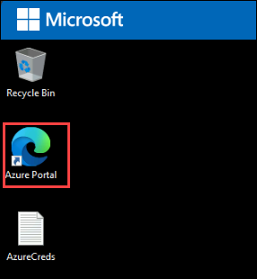
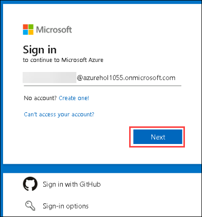
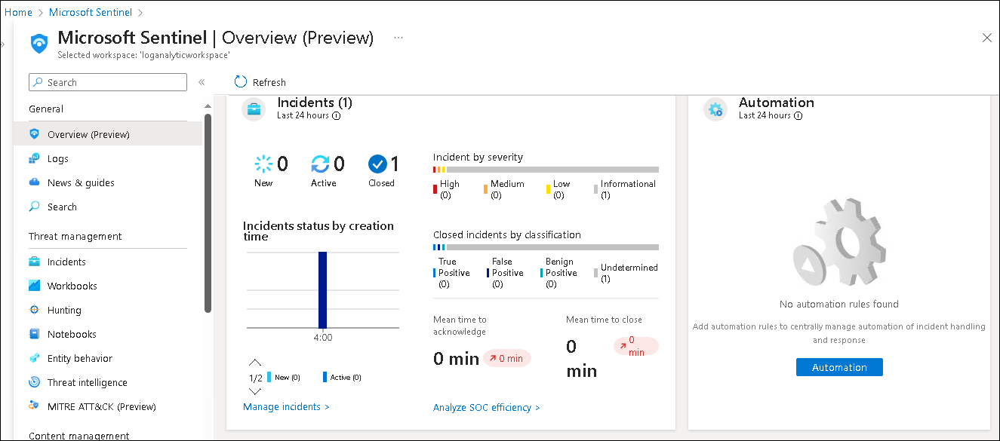
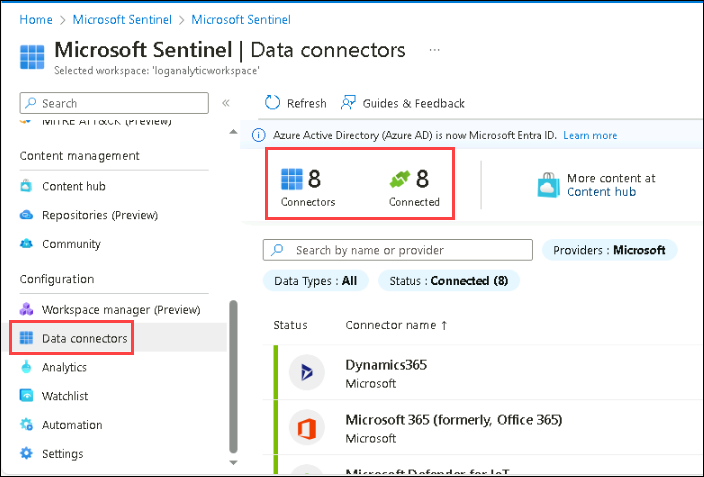
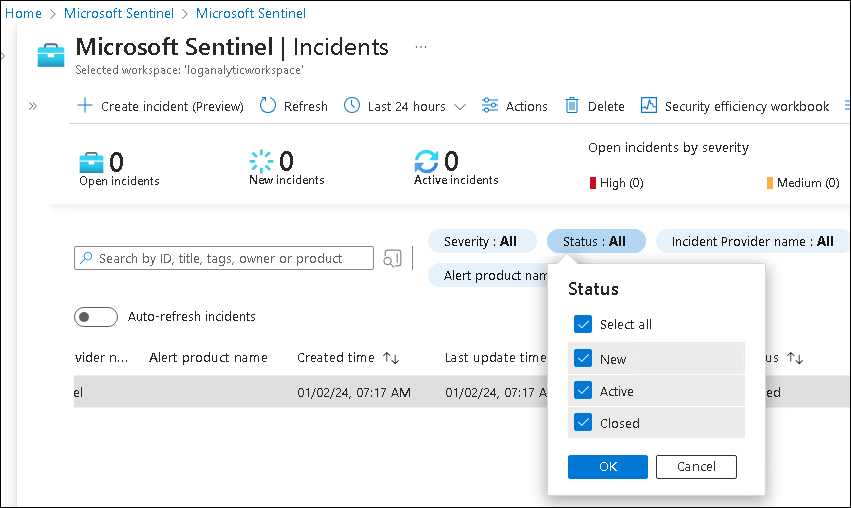
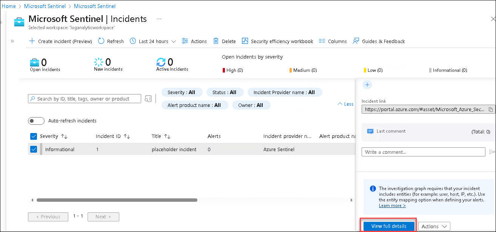

# Lab 01 - Review and explore sentinel workspace

## Lab scenario

In this lab, participants will explore a pre-configured Azure Sentinel workspace, investigating security incidents, configuring automated responses, and analyzing data to strengthen threat detection and response capabilities within the Azure environment.

## Lab objectives
 In this lab, you will perform the following:
 - Task 1: Log in to Azure Portal and verify the pre-deployed resources
 - Task 2: Explore Sentinel workspace
 - Task 3: Simulated Attacks
 - Task 4: Investigate the Attacks

### Exercise 1: Exploring a Pre-Created Azure Sentinel Workspace

### Task 1: Log in to Azure Portal and verify the pre-deployed resources.

1. In the virtual machine (VM) on the left, click on the Azure Portal as shown below.

    
    
1. On the **Sign into Microsoft Azure** tab, you will see the login screen. Enter the following **Email/Username** and then click on **Next**. 
   
   * Email/Username: <inject key="AzureAdUserEmail"></inject>

    

1. Enter the following **Password** and click on **Sign in**. 
   
   * Password: <inject key="AzureAdUserPassword"></inject>

    
    
1. First-time users are often prompted to Stay Signed In, if you see any such pop-up, click on No.
   
1. If a **Welcome to Microsoft Azure** popup window appears, click Maybe Later to skip the tour.

### Task 2: Explore Sentinel workspace

Sentinel workspace is a centralized platform by Microsoft Azure for managing, investigating, and responding to security threats across your organization's cloud services.

1. In the Search bar of the Azure portal, type *Sentinel*, then select **Microsoft Sentinel**.

    

1. Select the pre-created Sentinel workspace from the available list.

    

1. Explore the Overview page to get a summary of the workspace, including incidents, alerts, health, and other essential information.

   

1. Navigate to "Data connectors" on the left sidebar.

1. Review existing connectors configured for collecting security-related data.

   

1. Under the **threat management** section select **Incidents** from the left panel to review detected security incidents and alerts.

1. Select the status filter next to the search space and click on **Select all** checkbox to see all the new,active and closed incidents.

    

1. Select the **Informational** incident from the list to view details, and take necessary actions.

    

## Review
In this lab you have completed:
 - Log in to Azure Portal and verify the pre-deployed resources
 - Explore Sentinel workspace
