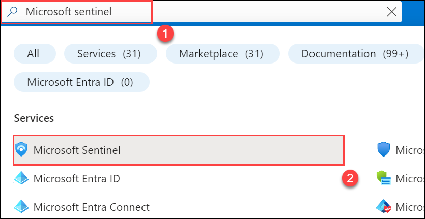
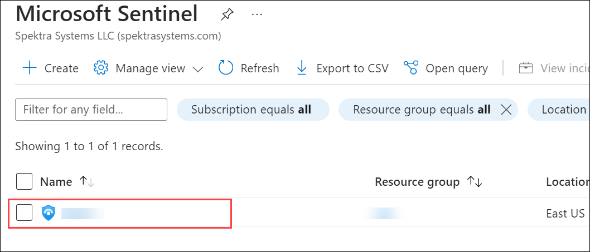
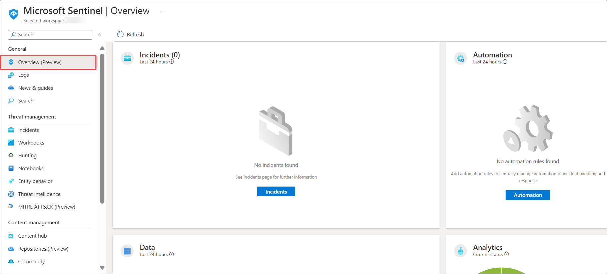
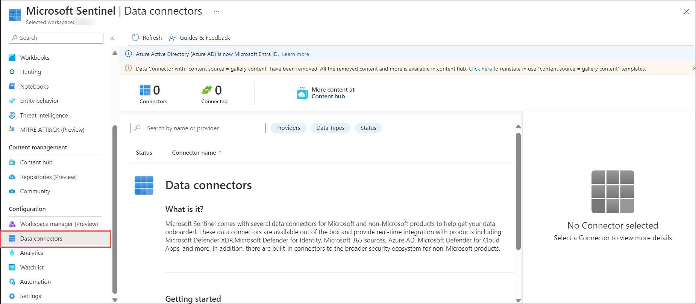
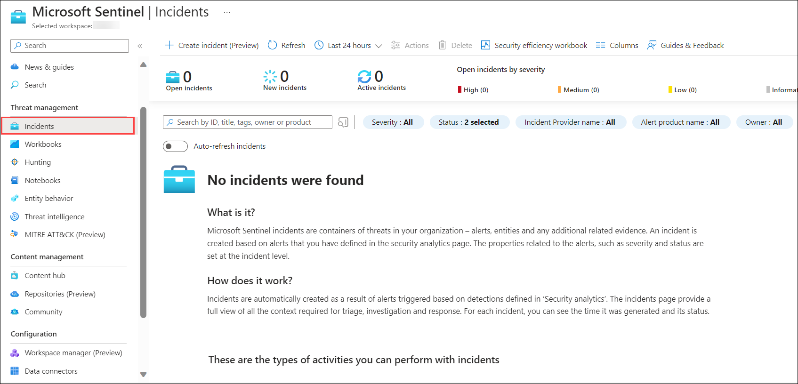
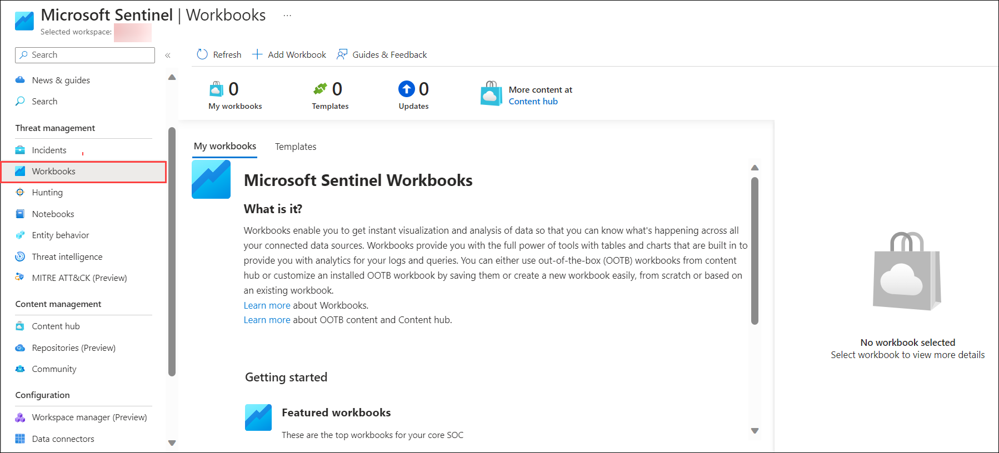
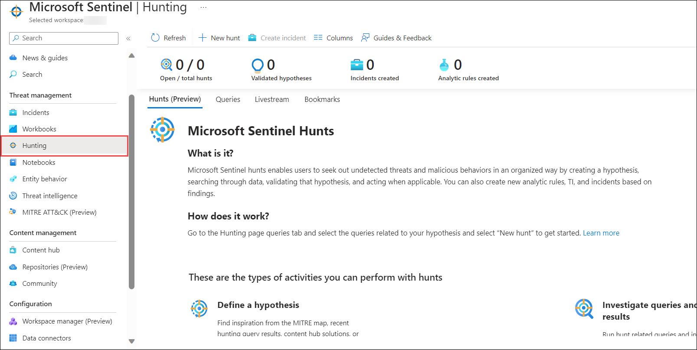
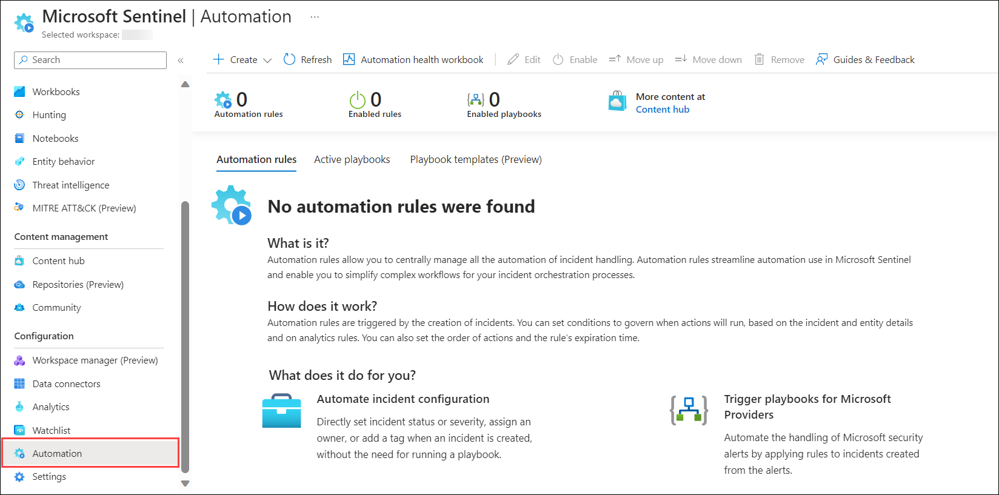
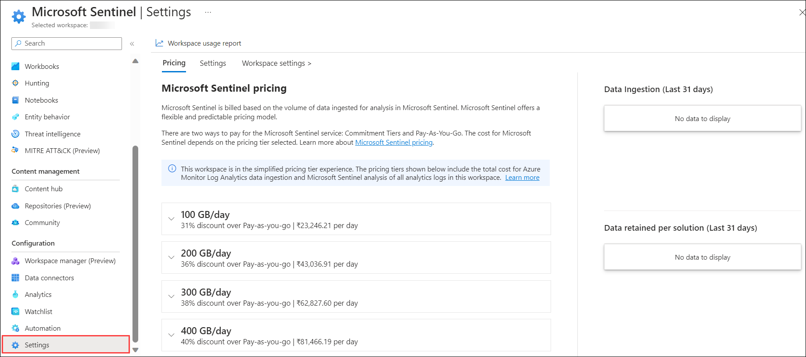

# Lab 01 - Review and explore sentinel workspace

## Lab scenario

In this lab, participants will explore a pre-configured Azure Sentinel workspace, investigating security incidents, configuring automated responses, and analyzing data to strengthen threat detection and response capabilities within the Azure environment

## Lab objectives
 In this lab, you will perform the following:
 - Task 1: Review Overview
 - Task 2: Explore Data Connectors
 - Task 3: Check Incidents and Alerts
 - Task 4: Explore Workbooks and Dashboards
 - Task 5: Hunt for Threats
 - Task 6: Configure Playbooks (Automation)
 - Task 7: Customize Settings
 - Task 8: Simulated Attacks
 - Task 9: Investigate the Attacks
 
## Estimated timing: 60 minutes

### Exercise 1: Exploring a Pre-Created Azure Sentinel Workspace

1. In the Search bar of the Azure portal, type *Sentinel*, then select **Microsoft Sentinel**.

    

1. Choose the pre-created Sentinel workspace from the available list.

    

### Task 1: Review Overview

1. Explore the Overview page to get a summary of the workspace, including incidents, alerts, health, and other essential information.

   

### Task 2: Explore Data Connectors

1. Navigate to "Data connectors" on the left sidebar.

1. Review existing connectors configured for collecting security-related data.

   

### Task 3: Check Incidents and Alerts

1. Visit the "Incidents" and "Alerts" sections to review detected security incidents and alerts.

1. Investigate incidents, view details, and take necessary actions.

    

### Task 4: Explore Workbooks and Dashboards

1. Access "Workbooks" or "Dashboards" to view pre-configured reports or create new visual representations of security data.

   

### Task 5: Hunt for Threats

1. Navigate to the "Hunting" section to run custom queries against data sources and search for potential threats or suspicious activities.

   

### Task 6: Configure Playbooks (Automation)

1. Review and configure Playbooks in the dedicated section for automated responses to alerts or incidents.

    

### Task 7: Customize Settings

1. Access the "Settings" section to review and adjust configurations related to data collection, connectors, analytics, and automation.

   

### Task 8: Simulated Attacks

In this task, you will run two simulated attacks to explore the capabilities of Microsoft Defender for Endpoint.

1. If you are not already at the Microsoft 365 Defender portal in your Microsoft Edge browser, go to (https://security.microsoft.com). 

1. In the **Sign in** dialog box, copy and paste * Email/Username: <inject key="AzureAdUserEmail"></inject> and then select Next.

1. In the **Enter password** dialog box, copy and paste * Password: <inject key="AzureAdUserPassword"></inject> and then select **Sign in**.

1. From the menu, under **Endpoints**, select **Evaluation & tutorials** and then select **Tutorials & simulations** from the left side.

1. Select the **Tutorials** tab.

1. Under *Automated investigation (backdoor)* you will see a message describing the scenario. Below this paragraph, click **Read the walkthrough**. A new browser tab opens which includes instructions to perform the simulation.

1. In the new browser tab, locate the section named **Run the simulation** (page 5, starting at step 2) and follow the steps to run the attack. **Hint:** The simulation file *RS4_WinATP-Intro-Invoice.docm* can be found back in portal, just below the **Read the walkthrough** you selected in the previous step by selecting the **Get simulation file** button. 

1. After downloading the file,  open the file with **Microsoft Word** and enter the password as `WDATP!diy#`.

1. In the Sign in dialog box, click on **Sign in** copy and paste in the Username and password provided in the environment details page, and select next.    

1. Click **Enable Editing** if the document opens inProtectedView. If you see a subsequent security warning about macros being disabled.    

1. To unblock the document, navigate to its location in File Explorer. In File Explorer, right-click the document, and select Properties. In the General tab, mark the Unblock option under Security.   

     

1. Close the **Microsoft Word** and re-open from the File Explorer and enter the password as `WDATP!diy#` after re-opening click on **Enable Content** and click on **OK**. 

1. In the Command prompt pop-up press any key to close. 
   
   
    >**Note:** **Congrats – you’re done running the attack!** The attack simulation ends here. A real attacker, if successful, would likely continue to scan for information, send collected reconnaissance information to a command-and-control (C&C) server, and use this information to move laterally and pursue other attractive targets. Next, let’s review and investigate the Defender for Endpoint alerts that surfaced in the simulated attack. **Note:** Alerts should start to appear 15-30 minutes after the simulated backdoor is launched.   

1. Go back to the portal and in *Automated investigation (fileless attack)* click on **Copy simulation script**.

1. Right-click the Windows Start button and select **Windows PowerShell (Admin)**.  

    . 

1. At the Windows PowerShell, paste and run the provided script. A few seconds later, notepad.exe is started and the simulated attack code is injected into it. The simulated attack code attempts communication to an external IP address simulating the C&C server.

### Task 9: Investigate the Attacks

1. In the Microsoft 365 Defender portal select **Incidents & alerts** from the left menu bar, then select **Incidents**.

1. A new incident called "Multi-stage incident..." is in the right pane. Click the incident name to load its details.

1. Select the **Manage incident** button and a new window blade appears. 

1. Under **Incident tags** type "Tutorial" and select **Tutorial (Create new)** to create a new tag. 

1. Select the toggle **Assign to** and add your user account (Me) as the owner of the incident. 

1. Under **Classification**, expand the drop-down menu. 

1. Under **Informational, expected activity**, select **Security testing**. 

1. Add any comments if desired and click **Save** to finish.

1. Review the contents of the Alerts, Devices, Users, Investigations, Evidence, Response, and Graph tabs. **Hint:** Some tabs might be hidden due to the size of your display. Select the ellipsis tab (...) to make them appear.

>**Warning:** The simulations and tutorials here are an excellent source of learning through practice.  Simulations and tutorials are being added and edited regularly in the portal.  However, some of these simulations & tutorials may interfere with the performance of the labs designed for this training course.  Only perform the simulations and tutorials recommended in the instructions provided for this lab when using the course provided Azure tenant.  You may perform the other simulations and tutorials *after* this training course is complete with this tenant.

## Review

In this lab you have completed:

- Reviewed Workspace Overview: Explored the Overview page for a summary of incidents, alerts, and overall workspace health.
- Explored Data Connectors: Examined existing connectors responsible for collecting security-related data.

- Checked Incidents & Alerts: Investigated security incidents and alerts, understanding detected threats and issues.

- Explored Workbooks & Dashboards: Accessed pre-configured reports or created new visualizations for security data.

- Hunted for Threats: Used the "Hunting" section to run custom queries against data sources to identify potential threats.

- Configured Playbooks: Reviewed and potentially configured Playbooks for automated responses to incidents.

- Customized Workspace Settings: Accessed settings to review and adjust configurations related to data collection, analytics, and automation.
