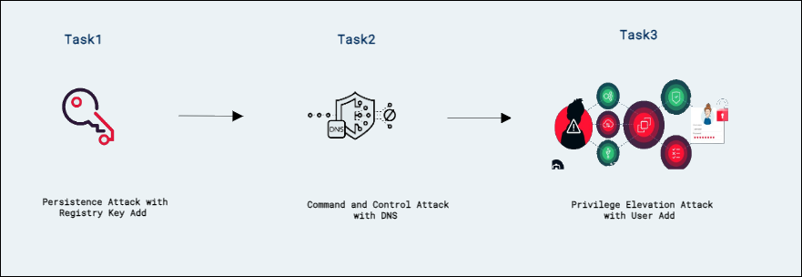
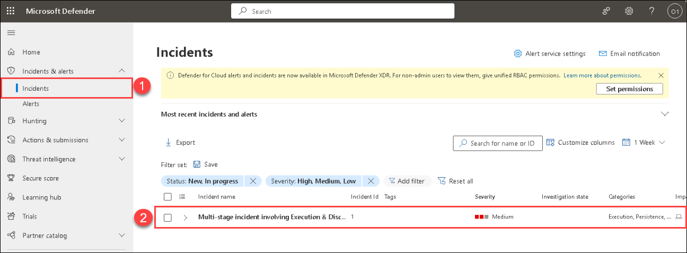
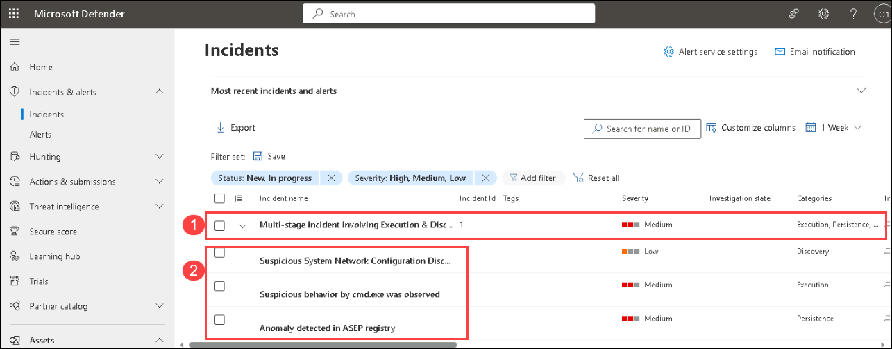
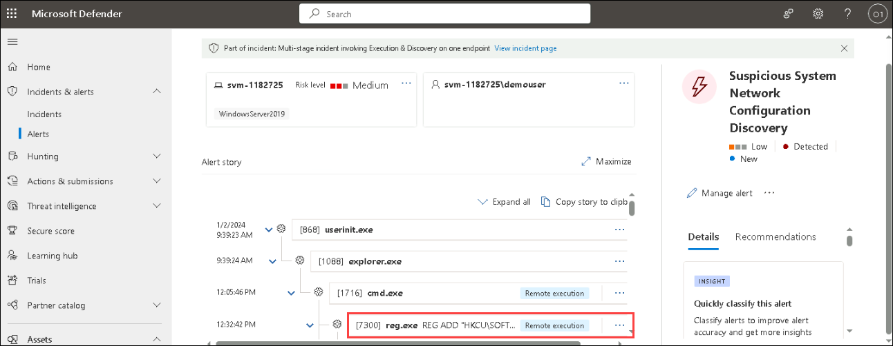
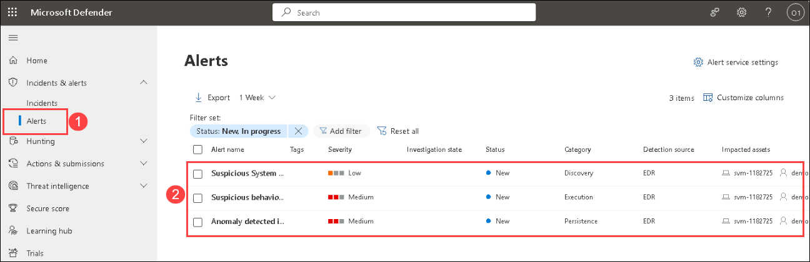

# Lab 05 - Conduct attacks

## Lab scenario

You are going to simulate the attacks that you will later use to detect and investigate in Microsoft Defender.

## Lab objectives
 In this lab, you will perform the following:
- Task 1:Simulated Attacks
- Task 2:Investigate the Attacks
- Task 3: Persistence Attack with Registry Key Add
- Task 4: Command and Control Attack with DNS
- Task 5: Privilege Elevation Attack with User Add
- Task 6: Investigate the Incident in M365 Defender Portal

## Architecture Diagram

  

### Task 1: Simulated Attacks

In this task, you will run two simulated attacks to explore the capabilities of Microsoft Defender for Endpoint.

1. If you are not already at the Microsoft 365 Defender portal in your Microsoft Edge browser, go to (https://security.microsoft.com). 

1. In the **Sign in** dialog box, copy and paste * Email/Username: <inject key="AzureAdUserEmail"></inject> and then select Next.

1. In the **Enter password** dialog box, copy and paste * Password: <inject key="AzureAdUserPassword"></inject> and then select **Sign in**.

1. From the menu, under **Endpoints**, select **Evaluation & tutorials** and then select **Tutorials & simulations** from the left side.

   

1. Select the **Tutorials** tab.

1. Under *Automated investigation (backdoor)* you will see a message describing the scenario. Below this paragraph, click **Read the walkthrough**. A new browser tab opens which includes instructions to perform the simulation.

   

1. In the new browser tab, locate the section named **Run the simulation** (page 5, starting at step 2) and follow the steps to run the attack. **Hint:** The simulation file *RS4_WinATP-Intro-Invoice.docm* can be found back in portal, just below the **Read the walkthrough** you selected in the previous step by selecting the **Get simulation file** button. 

1. After downloading the file,  open the file with **Microsoft Word** and enter the password as `WDATP!diy#`.

1. In the Sign in dialog box, click on **Sign in** copy and paste in the Username and password provided in the environment details page, and select next.    

1. Click **Enable Editing** if the document opens inProtectedView. If you see a subsequent security warning about macros being disabled.    

1. To unblock the document, navigate to its location in File Explorer. In File Explorer, right-click the document, and select Properties. In the General tab, mark the Unblock option under Security.   

1. Close the **Microsoft Word** and re-open from the File Explorer and enter the password as `WDATP!diy#` after re-opening click on **Enable Content** and click on **OK**. 

1. In the Command prompt pop-up press any key to close. 
      
>**Note:** **Congrats – you’re done running the attack!** The attack simulation ends here. A real attacker, if successful, would likely continue to scan for information, send collected reconnaissance information to a command-and-control (C&C) server, and use this information to move laterally and pursue other attractive targets. Next, let’s review and investigate the Defender for Endpoint alerts that surfaced in the simulated attack.

>**Note:** Alerts should start to appear 15-30 minutes after the simulated backdoor is launched.

### Task 2: Investigate the Attacks

1. In the Microsoft 365 Defender portal select **Incidents & alerts** from the left menu bar, then select **Incidents**.

1. A new incident called "Multi-stage incident..." is in the right pane. Click the incident name to load its details.

1. Select the **Manage incident** button and a new window blade appears. 

1. Under **Incident tags** type "Tutorial" and select **Tutorial (Create new)** to create a new tag. 

1. Select the toggle **Assign to**  and add your user account (Me) as the owner of the incident. 

1. Under **Classification**, expand the drop-down menu. 

1. Under **Informational, expected activity**, select **Security testing**. 

1. Add any comments if desired and click **Save** to finish.

1. Review the contents of the Alerts, Devices, Users, Investigations, Evidence, Response, and Graph tabs. **Hint:** Some tabs might be hidden due to the size of your display. Select the ellipsis tab (...) to make them appear.

>**Warning:** The simulations and tutorials here are an excellent source of learning through practice.  Simulations and tutorials are being added and edited regularly in the portal.  However, some of these simulations & tutorials may interfere with the performance of the labs designed for this training course.  Only perform the simulations and tutorials recommended in the instructions provided for this lab when using the course provided Azure tenant.  You may perform the other simulations and tutorials *after* this training course is complete with this tenant.

### Task 3: Persistence Attack with Registry Key Add 

>**Note:** Perform this task in your LAB-VM.

1. In the search of the task bar, enter *Command*. Command Prompt will be displayed in the search results. Right-click on the Command Prompt and select **Run as Administrator**. Select **Yes** in the User Account Control window that appears to allow the app to run.

1. In the Command Prompt, create a Temp folder in the root directory. Remember to press Enter after the last row:

    ```CommandPrompt
    cd \
    mkdir temp
    cd temp
    ```

1. Copy and run this command to simulate program persistence:

    ```CommandPrompt
    REG ADD "HKCU\SOFTWARE\Microsoft\Windows\CurrentVersion\Run" /V "SOC Test" /t REG_SZ /F /D "C:\temp\startup.bat"
    ```

### Task 4: Command and Control Attack with DNS

>**Note:** Perform this task in your LAB-VM.

1. Copy and run this command to create a script that will simulate a DNS query to a C2 server:

    ```CommandPrompt
    notepad c2.ps1
    ```

1. Select **Yes** to create a new file and copy the following PowerShell script into *c2.ps1*.

    >**Note:** Pasting into the virtual machine file might not show the full script length. Make sure the script matches the instructions within the *c2.ps1* file.

    ```PowerShell
    param(
        [string]$Domain = "microsoft.com",
        [string]$Subdomain = "subdomain",
        [string]$Sub2domain = "sub2domain",
        [string]$Sub3domain = "sub3domain",
        [string]$QueryType = "TXT",
        [int]$C2Interval = 8,
        [int]$C2Jitter = 20,
        [int]$RunTime = 240
    )
    $RunStart = Get-Date
    $RunEnd = $RunStart.addminutes($RunTime)
    $x2 = 1
    $x3 = 1 
    Do {
        $TimeNow = Get-Date
        Resolve-DnsName -type $QueryType $Subdomain".$(Get-Random -Minimum 1 -Maximum 999999)."$Domain -QuickTimeout
        if ($x2 -eq 3 )
        {
            Resolve-DnsName -type $QueryType $Sub2domain".$(Get-Random -Minimum 1 -Maximum 999999)."$Domain -QuickTimeout
            $x2 = 1
        }
        else
        {
            $x2 = $x2 + 1
        }    
        if ($x3 -eq 7 )
        {
            Resolve-DnsName -type $QueryType $Sub3domain".$(Get-Random -Minimum 1 -Maximum 999999)."$Domain -QuickTimeout
            $x3 = 1
        }
        else
        {
            $x3 = $x3 + 1
        }
        $Jitter = ((Get-Random -Minimum -$C2Jitter -Maximum $C2Jitter) / 100 + 1) +$C2Interval
        Start-Sleep -Seconds $Jitter
    }
    Until ($TimeNow -ge $RunEnd)
    ```

1. In the Notepad menu, select **File** and then **Save**. 

1. Go back to the Command Prompt window, enter the following command and press Enter.

    ```CommandPrompt
    Start PowerShell.exe -file c2.ps1
    ```
    
      
   
    >**Note:** You will see DNS resolve errors. This is expected.

    >**Important**: Do not close these windows. Let this PowerShell script run in the background. The command needs to generate log entries for some hours. You can proceed to the next task and next exercises while this script runs. The data created by this task will be used in the Threat Hunting lab later. This process will not create substantial amounts of data or processing.

### Task 5: Privilege Elevation Attack with User Add

>**Important:** The next steps are done on a different machine than the one you were previously working on. Look for the Virtual Machine name references.

1. In Azure portal, search for Virtual Machines and login to **s2vm-xxxx** virtual machine with the below admin credentials:

   * Admin Username:
   * Admin Password:

1. In the search of the taskbar of your **s2vm-xxxx** VM, enter *Command*. A Command Prompt will be displayed in the search results. Right-click on the Command Prompt and select **Run as Administrator**. Select **Yes** in the User Account Control window that appears to allow the app to run.

1. In the Command Prompt, create a Temp folder in the root directory. Remember to press Enter after the last row:

    ```CommandPrompt
    cd \
    ```
    ```CommandPrompt
    mkdir temp
    ```
    ```CommandPrompt
    cd temp
    ```

1. Copy and run this command to simulate the creation of an Admin account. Remember to press Enter after the last row:

    ```CommandPrompt
    net user theusernametoadd /add
    ```
    ```CommandPrompt
    net user theusernametoadd ThePassword1!
    ```
    ```CommandPrompt
    net localgroup administrators theusernametoadd /add
    ```

### Task 6: Investigate the Incident in M365 Defender Portal

In this task, you will login to the M365 Defender portal and view the attacks which were conducted in the previous task.

1. Login to the Microsoft M365 Defender portal (https://security.microsoft.com/) using your Azure username and password.

   * Username: <inject key="AzureAdUserEmail"></inject>
   * Password: <inject key="AzureAdUserPassword"></inject>

1. Once you have logged into M365 Defender portal, navigate to **Incidents**(1) from the sidebar menu and view the newly created incident named **Multi-stage incident involving Execution & Discovery on one endpoint**(2).

   

1. Click on the incident to investigate on the further details.

   

1. Now let us look at each of these incidents to investigate the attacks performed in the previous tasks. Click on the dropdown to view all the incidents.

   

1. In the **Suspicious System Network Configuration Discovery** incident, you can see that this alert was created due to running the commands in previous tasks.

   

1. Similarly, you can also further investigate the other alerts by navigating to **Alerts** tab.

   

## Review
In this lab, you have completed the following:
- Simulated Attacks
- Investigate the Attacks
- Persistence Attack with Registry Key Add
- Command and Control Attack with DNS
- Privilege Elevation Attack with User Add
- Investigate the Incident in M365 Defender Portal
