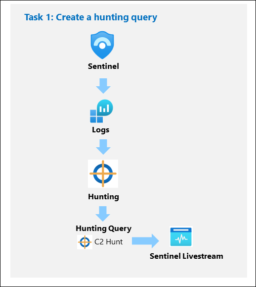
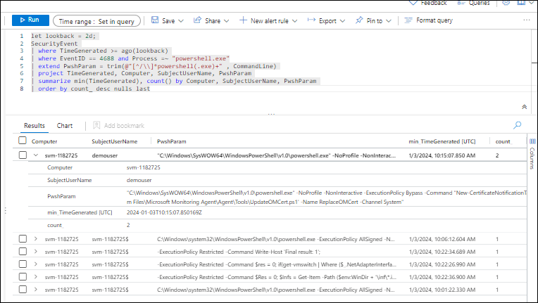
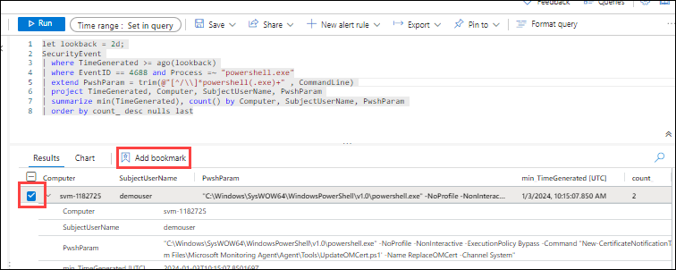
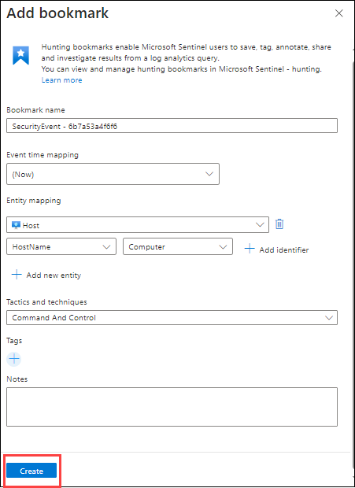
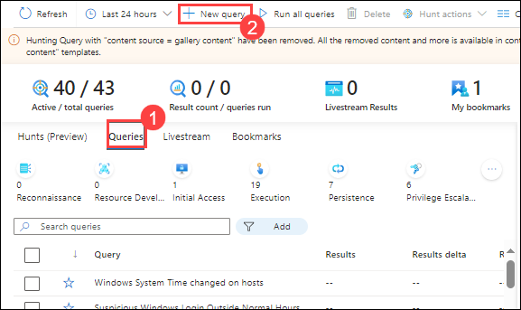
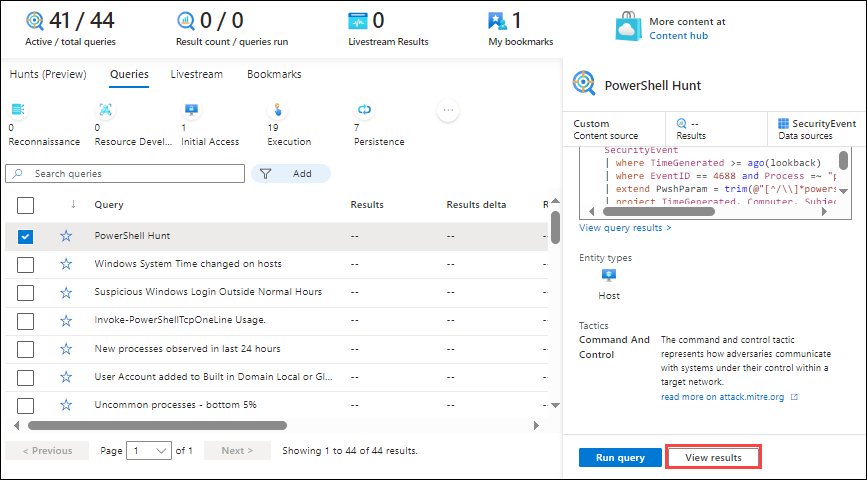
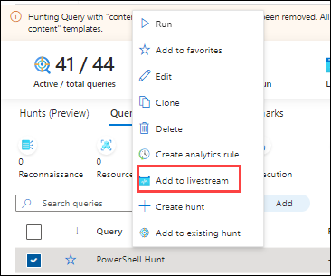
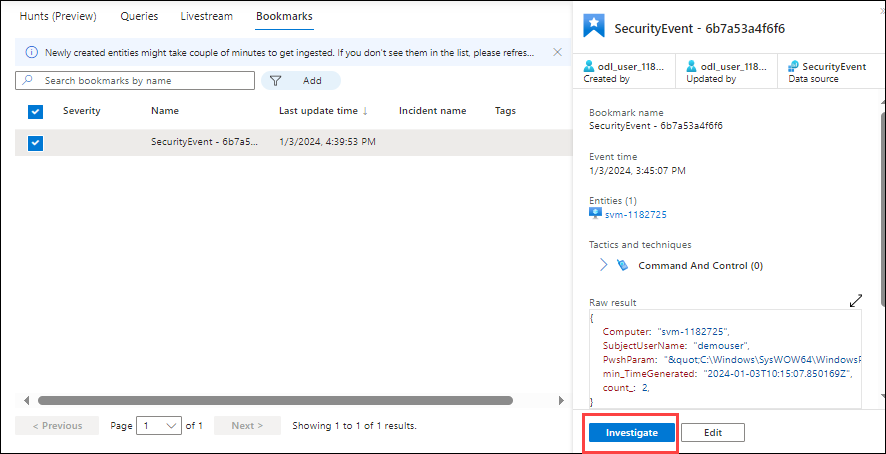

## Lab 09 - Threat Hunting using Notebooks with Microsoft Sentinel

## Lab scenario

You are a Security Operations Analyst working at a company that implemented Microsoft Sentinel. You have received threat intelligence about a Command and Control (C2 or C&C) technique.  You need to perform a hunt and watch for the threat.

## Lab objectives
 In this lab, you will perform the following:
 - Task 1: Create a hunting query
 - Task 2: Create a NRT query rule
 - Task 3: Create a Search
 - Task 4: Explore Notebooks

## Architecture Diagram

 

### Task 1: Create a hunting query

In this task, you will create a hunting query, bookmark a result, and create a Livestream.

1. In the Search bar of the Azure portal, type *Sentinel*, then select **Microsoft Sentinel**.

1. Select your Microsoft Sentinel Workspace.

1. Select **Logs** from the left menu.

1. Enter the following KQL Statement in the *New Query 1* space:

   >**Important:** Please paste any KQL queries first in Notepad and then copy from there to the *New Query 1* Log window to avoid any errors.

    ```KQL
    let lookback = 2d; 
    SecurityEvent 
    | where TimeGenerated >= ago(lookback) 
    | where EventID == 4688 and Process =~ "powershell.exe"
    | extend PwshParam = trim(@"[^/\\]*powershell(.exe)+" , CommandLine) 
    | project TimeGenerated, Computer, SubjectUserName, PwshParam 
    | summarize min(TimeGenerated), count() by Computer, SubjectUserName, PwshParam 
    | order by count_ desc nulls last 
    ```

1. Review the different results. You have now identified PowerShell requests that are running in your environment.

    

1. Select the checkbox of the results that shows the **demouser** SubjectUsername.

1. In the middle command bar, select the **Add bookmark** button.

   

1. Select **+ Add new entity** under *Entity mapping*.

1. For *Entity* select **Host**, then **Hostname** and **Computer** for the values.

1. For *Tactics and Techniques*, select **Command and Control**.

1. Go back to the *Add bookmark* blade, and the select **Create**. We will map this bookmark to an incident later.

   

1. Close the *Logs* window by selecting the **X** in the top-right of the window and select **OK** to discard the changes. 

1. Select your Microsoft Sentinel workspace again and select the **Hunting** page under the *Threat Management* area.

1. Select the **Queries (1)** tab and then **+ New Query (2)** from the command bar.

   

1. In the *Create hunting query* window, for the *Name* enter **PowerShell Hunt**.

1. For the *Custom query* enter the following KQL statement:

    ```KQL
    let lookback = 2d; 
    SecurityEvent 
    | where TimeGenerated >= ago(lookback) 
    | where EventID == 4688 and Process =~ "powershell.exe"
    | extend PwshParam = trim(@"[^/\\]*powershell(.exe)+" , CommandLine) 
    | project TimeGenerated, Computer, SubjectUserName, PwshParam 
    | summarize min(TimeGenerated), count() by Computer, SubjectUserName, PwshParam 
    | order by count_ desc nulls last 
    ```

1. Scroll down and under *Entity mapping* select:
   
    - Select **+ Add new entity** under *Entity mapping*.
    - For the *Entity type* drop-down list select **Host**.
    - For the *Identifier* drop-down list select **HostName**.
    - For the *Value* drop-down list select **Computer**.

1. Scroll down and under *Tactics & Techniques* select **Command and Control** and then select **Create** to create the hunting query.

    

1. In the *"Microsoft Sentinel - Hunting"* blade, search for the query you just created in the list, *PowerShell Hunt*.

1. Select **PowerShell Hunt** from the list.

1. Select the **View Results** button from the right pane. The KQL query will automatically run.

   

1. Close the *Logs* window by selecting the **X** in the top-right of the window and select **OK** to discard the changes. 

1. Right-click the **PowerShell Hunt** query and select **Add to livestream**. **Hint:** This also can be done by sliding right and selecting the ellipsis **(...)** at the end of the row to open a context menu.

   

1. Review that the *Status* is now *Running*. This will be running every 30 seconds in the background, and you will receive a notification in the Azure Portal (bell icon) when a new result is found. 

1. Select the **Bookmarks** tab in the middle pane.

1. Select the bookmark you just created from the results list.

1. On the right pane, scroll down and select the **Investigate** button. **Hint:** It might take a couple of minutes to show the investigation graph.

   

1. Explore the Investigation graph. Notice the high number of *Related alerts* for *svm-xxxx*.

1. Close the *Investigation* graph window by selecting the **X** in the top-right of the window. 

1. Hide the right blade by selecting the **>>** icon and then scroll right until you see the ellipsis **(...)** icon.

1. Select **Add to existing incident**. All the incidents appear in the right pane.

1. Select one of the incidents and then select **Add**. 

   

1. Scroll left to notice that the *Severity* column is now populated with the incident's data.

### Task 2: Create a NRT query rule

In this task, instead of using a LiveStream, you will create a NRT analytics query rule. NRT rules run every minute and look back one minute. The benefit of NRT rules is they can use the alert and incident creation logic.

1. Select the **Analytics** page under *Configuration* in Microsoft Sentinel. 

1. Select the **Create** tab, then **NRT query rule (Preview)**.

1. This starts the "Analytics rule wizard". For the *General* tab type:

    |Setting|Value|
    |---|---|
    |Name|**NRT PowerShell Hunt**|
    |Description|**NRT PowerShell Hunt**|
    |Severity|**High**|
    |Tactics|**Command and Control**|

1. Select **Next: Set rule logic >** button. 

1. For the *Rule query* enter the following KQL statement:

    ```KQL
    let lookback = 2d; 
    SecurityEvent 
    | where TimeGenerated >= ago(lookback) 
    | where EventID == 4688 and Process =~ "powershell.exe"
    | extend PwshParam = trim(@"[^/\\]*powershell(.exe)+" , CommandLine) 
    | project TimeGenerated, Computer, SubjectUserName, PwshParam 
    | summarize min(TimeGenerated), count() by Computer, SubjectUserName, PwshParam
    ```

1. Select **View query results >** to make sure your query does not have any errors.

1. Close the *Logs* window by selecting the **X** in the top-right of the window and select **OK** to discard the changes. 

1. Under *Entity mapping* select:
     
    - Select **+ Add new entity** under *Entity mapping*.
    - For the *Entity type* drop-down list select **Host**.
    - For the *Identifier* drop-down list select **HostName**.
    - For the *Value* drop-down list select **Computer**.

1. Scroll down and select **Next: Incident settings>** button.

1. For the *Incident settings* tab, leave the default values and select **Next: Automated response>** button.

1. For the *Automated response* tab, leave the default values and select **Next: Review and create >** button.

1. On the *Review and Create* tab, select the **Save** button to create and save the new Scheduled Analytics rule.

### Task 3: Create a Search job

In this task, you will use a Search job to look for a C2.

1. On the left menu Select the **Search** page under *General* in Microsoft Sentinel.

1. In the search box, enter **reg.exe** and then select **Start**.

1. A new window running the query opens. Select the ellipsis icon **(...)** from the top right and then toggle the **Search job mode**.

1. Select **Search job** button from the command bar. 

1. The search job creates a new table with your results as soon as they arrive. The results can be consulted from the *Saved Searches* tab.

1. Close the *Logs* window by selecting the **X** in the top-right of the window and select **OK** to discard the changes. 
 
1. Select the **Restoration** tab from the command bar and then the **Restore** button.

1. Under *Select a table to restore*, search for and select **SecurityEvent**.

1. Review the options available and then select the **Cancel** button.

    >**Note:** If you were running the job, the restore would run for a couple of minutes and your data would be available in a new table.

### Task 4: Explore Notebooks

In this task, you will explore using notebooks in Microsoft Sentinel.

1. In the Microsoft Sentinel Workspace, select **Notebooks** under the *Threat management* area.

1. Next, you need to create an AzureML Workspace. Select **Configure Azure Machine Learning** and then select the **Create new Azure ML workspace** button in the command bar.

     

1. In the Subscription box, select your subscription.

1. Select **Create new** for the Resource group and enter *RG-MachineLearning* for the Name and select **OK**. 

1. In the Workspace details section do the following:

     - Give your workspace a unique name.
     - Leave **East US** as the default value for *Region*.
     - Keep the default Storage account, Key vault, and Application insights information.
     - The Container registry option can remain as **None**.

1. At the bottom of the page, select **Review + Create**. When you see the *"Validation passed"* message, select **Create**. 

     >**Note:** It may take a few minutes to deploy the Machine Learning workspace.

1. After *Your deployment is complete* message appears, return to the Microsoft Sentinel portal.

1. Select **Notebooks** again and then select the **Templates** tab from the middle command bar. 

1. Select **A Getting Started Guide for Microsoft Sentinel** ML Notebooks. 

1. On the right pane, scroll down and select **Create from template** button. Review the default options and then select **Save**.

   

1. Once the saving is done, select the **Launch notebook** button. This will take you to the Microsoft Azure Machine Learning Studio.

    

1. Select **X** if an informational window appears in the Microsoft Azure Machine Learning Studio.

1. In the command bar, to the right of the **Compute instance:**  selector, select the **+** symbol to create a new compute instance. **Hint:** It might be hidden inside the ellipsis icon **(...)**.

     >**Note:** You can have more screen space by hiding the Azure ML Studio left blade by selecting the 3 lines on the top left, as well as the Notebooks Files by selecting the **<<** icon.

1. Type a unique name in the *Compute name* field. This will identify your compute instance.

1. Scroll down and select the first option available. **Hint:** Workload type: Development on Notebooks and lightweight testing.

1. Select the **Create** button at the bottom of the screen. Close any feedback window that may appear. This will take a few minutes; you will see a notification (bell icon) when it is done and the *Compute instance* left icon turns from blue to green.

1. Once the Compute has been created and running, verify that the kernel to use is *Python 3.8 - AzureML*. **Hint:** This is shown in the right of the command bar.

1. Select the **Authenticate** button and wait for the authentication to complete.

1. Clear all the results from the notebook by selecting the **Clear all outputs** from the command bar and following the *Getting Started* tutorial. **Hint:** This can be found by selecting the ellipsis (...) from the command bar.

>**Note:** If you cannot complete the steps above to access the Notebook, you can follow it on its GitHub viewer page instead. [Getting Started with Azure ML Notebooks and Microsoft Sentinel](https://nbviewer.org/github/Azure/Azure-Sentinel-Notebooks/blob/master/A%20Getting%20Started%20Guide%20For%20Azure%20Sentinel%20ML%20Notebooks.ipynb)

## Review
In this lab, you have completed the following:
- We created a hunting query.
- We created an NRT query rule.
- We Created a Search.
- Explore Notebooks
